```mermaid

gantt
    title Shortest Job First (Arrival & Burst Time)
    dateFormat  X
    axisFormat  %s
    tickInterval 1

    section Arrival
    P1 arrives :milestone, a1, 0, 0
    P2 arrives :milestone, a2, 4, 0
    P3 arrives :milestone, a3, 8, 0

    section Execution
    P1 (Executes 0–6) :active, p1, 0, 6
    P3 (Executes 6–9) :active, p3, 6, 9
    P2 (Executes 9–17) :active, p2, 9, 17
```

```mermaid
%%{init: {'theme':'base', 'themeVariables': {'primaryColor':'#4A90E2','primaryTextColor':'#2C3E50','primaryBorderColor':'#34495E','lineColor':'#7F8C8D','secondaryColor':'#5CB85C','tertiaryColor':'#E67E22','background':'#ECF0F1','mainBkg':'#BDC3C7','secondBkg':'#95A5A6','textColor':'#2C3E50','fontSize':'14px'}}}%%
gantt
    title Shortest Remaining Time First (Arrival & Burst Time)
    dateFormat  X
    axisFormat  %s
    tickInterval 1

    section Arrival
    P1 arrives :milestone, a1, 0, 0
    P2 arrives :milestone, a2, 2, 0
    P3 arrives :milestone, a3, 4, 0

    section Execution
    P1 (Executes 0–1) :active, p1, 0, 1
    P2 (Executes 1–4) :active, p2, 1, 4
    P1 (Executes 4–9) :active, p1, 4, 9
    P3 (Executes 9–16) :active, p3, 9, 16
```

```mermaid
%%{init: {'theme':'base', 'themeVariables': {'primaryColor':'#4A90E2','primaryTextColor':'#2C3E50','primaryBorderColor':'#34495E','lineColor':'#7F8C8D','secondaryColor':'#5CB85C','tertiaryColor':'#E67E22','background':'#ECF0F1','mainBkg':'#BDC3C7','secondBkg':'#95A5A6','textColor':'#2C3E50','fontSize':'14px'}}}%%
gantt
    title HRRN Scheduling (Arrival & Burst Time)
    dateFormat  X
    axisFormat  %s
    tickInterval 1

    section Arrival
    P1 arrives :milestone, a1, 0, 0
    P2 arrives :milestone, a2, 2, 0
    P3 arrives :milestone, a3, 4, 0
    P4 arrives: milestone, a4, 6, 0

    section Execution
    P1 (Executes 0–5) :active, p1, 0, 5
    P2 (Executes 5–8) :active, p2, 5, 8
    P4 (Executes 8–14) :active, p4, 8, 14
    P3 (Executes 14-22) :active, p3, 14, 22
```

>Note's credit : Zunayed Iqbal Shahed
## What is CPU Scheduling?

<u>CPU Scheduling is a process used by the Operating System to decide which task or process (program in execution) gets to use the CPU at a particular time.</u>

The CPU can handle one task at a time, but there are usually many tasks that need to be processed in a multiprogrammed computer system. By switching the CPU among processes/tasks, the operating system makes the computer more productive.

The main function of CPU scheduling is to ensure that whenever the CPU remains idle, the OS has at least selected one of the processes available in the ready-to-use line.

### Main Motivations for CPU Scheduling

1. Maximize CPU utilization
2. Minimize response and waiting time for processes

## Key Terminologies

### 1. Arrival Time (AT)
The time at which the process arrives in the ready queue.

### 2. Completion Time (CT)
The time at which the process completes its execution successfully.

### 3. CPU & I/O Burst Cycle
Process execution in CPU consists of a cycle of **CPU execution** and **I/O wait**. Processes alternate between these two states.

- **CPU Burst Time**: Time required by a process for CPU execution
- **I/O Burst Time**: The time a process spends waiting for an input/output operation to finish

Process execution begins with a **CPU Burst**, followed by an **I/O Burst**, then another **CPU Burst**, then another **I/O Burst**, and so on. Eventually, the final CPU Burst ends with a system request to terminate execution.

![[CPU & IO Burst.jpg | 250 center]]

### 4. Turn Around Time (TAT)
Time difference between completion time and arrival time.

$$\text{Turn Around Time} = \text{Completion Time} - \text{Arrival Time}$$

### 5. Waiting Time (WT)
Time difference between turnaround time and burst time.

$$\text{Waiting Time} = \text{Turn Around Time} - \text{Burst Time}$$

### 6. CPU Scheduler
Whenever the CPU remains idle, the OS must select one of the processes in the ready queue to be executed. The selection process is carried out by the **short-term scheduler** (or CPU scheduler). The scheduler selects a process from the processes in memory that are ready to execute and allocates the CPU to that process.

### 7. Dispatcher
The dispatcher is the module that gives control of the CPU to the process selected by the short-term scheduler. It performs the following operations:

1. Switching context
2. Switching to user mode
3. Jumping to the proper location in the user program to restart the program

The time it takes for the dispatcher to stop one process and start another running is known as **dispatch latency**.

![[dispatch latency.jpg | 450 center]]

### 8. Response Time-Based Testing (RTT)

RTT is a **performance evaluation method** used mainly in **real-time systems** to check whether each task or process **meets its timing constraints** — especially its **deadline**. It focuses on measuring or computing the **response time (Rᵢ)** of tasks and comparing it to their **deadline (Dᵢ)**.

A task is schedulable if:

$$R_i \leq D_i$$

The **Response Time** of a task *i* is the **total time elapsed** between:
- The **release** of the task (when it becomes ready), and
- The **completion** of the task (when it finishes execution)

$$R_i = F_i - A_i$$

Where:
- $A_i$ = activation (start ready) time
- $F_i$ = finish (completion) time

#### Response-Time Equation Derivation

In **fixed-priority preemptive scheduling** (like Rate Monotonic Scheduling), a task's response time depends on:
- Its own execution time
- The interference (delays) caused by higher-priority tasks

**Assumptions:**
1. Time is measured relative to the release of the job of interest (release at $t = 0$)
2. $C_i$: worst-case execution (computation) time of task $i$
3. $T_j, C_j$: period and worst-case execution time of any task $j$
4. $hp(i)$: set of tasks with **higher priority** than task $i$
5. We seek the **worst-case response time** $R_i$

**Why the ceiling term:**

Releases of task $j$ occur at times $0, T_j, 2T_j, \ldots$. The number of releases of $j$ that can occur in the interval $[0, R_i]$ is:

$$\left\lceil \frac{R_i}{T_j} \right\rceil$$

Each such release may take up to $C_j$ time, so the maximum interference from $j$ is $\left\lceil \frac{R_i}{T_j} \right\rceil C_j$.

**Response-time identity:**

$$\boxed{R_i = C_i + \sum_{j \in hp(i)} \left\lceil \frac{R_i}{T_j} \right\rceil C_j}$$

This is an implicit equation because $R_i$ appears on both sides.

**Iterative (fixed-point) solution:**

- **Initialization**: $R_i^{(0)} = C_i$
- **Iteration**: $R_i^{(k+1)} = C_i + \sum_{j \in hp(i)} \left\lceil \frac{R_i^{(k)}}{T_j} \right\rceil C_j$
- **Termination**: 
  - If $R_i^{(k+1)} = R_i^{(k)}$, the sequence has converged to the fixed point $R_i$
  - If at any step $R_i^{(k+1)} > D_i$, the task misses its deadline

**Worked Example:**

Consider tasks:
- Task $i$: $C_i = 4$, deadline $D_i = 12$
- One higher-priority task $j$: $T_j = 5$, $C_j = 2$

**Iteration:**
- $R^{(0)} = 4$
- $R^{(1)} = 4 + \left\lceil \frac{4}{5} \right\rceil 2 = 4 + 1 \cdot 2 = 6$
- $R^{(2)} = 4 + \left\lceil \frac{6}{5} \right\rceil 2 = 4 + 2 \cdot 2 = 8$
- $R^{(3)} = 4 + \left\lceil \frac{8}{5} \right\rceil 2 = 4 + 2 \cdot 2 = 8$ → **converged**

**Result:** $R_i = 8 \leq D_i = 12$ → task meets its deadline.

#### RTT Example Problem

**Question:** Do the Schedulability Test for the below scenario:

| Task | Pᵢ | Cᵢ |
|------|----|----|
| a    | 80 | 40 |
| b    | 40 | 10 |
| c    | 20 | 5  |

Verify your result with the help of a Gantt chart.

**Answer:**

According to Utilization Bound Test (UBT): $U_T \leq 3 \cdot (2^{1/3} - 1)$ or $U_T \leq 0.779$

Now, $U_T = \frac{40}{80} + \frac{10}{40} + \frac{5}{20} = 1$

Therefore, $U_T \leq 0.779$ is not true, and the **UBT test fails**.

Now we do the **RTT**:

**RTT for Task C:**
- $hp(c) = \varnothing$ (no higher-priority tasks)
- $R_c = C_c = 5$
- Deadline check: $R_c = 5 \leq P_c = 20$ ✅

**RTT for Task B:**
- $hp(b) = \{c\}$
- **Iteration 0:** $R_b^{(0)} = C_b = 10$
- **Iteration 1:** $R_b^{(1)} = 10 + \lceil 10/20 \rceil \cdot 5 = 10 + 5 = 15$
- **Iteration 2:** $R_b^{(2)} = 10 + \lceil 15/20 \rceil \cdot 5 = 10 + 5 = 15$
- ✅ Converged: $R_b = 15 \leq P_b = 40$ → schedulable

**RTT for Task A:**
- $hp(a) = \{b, c\}$
- **Iteration 0:** $R_a^{(0)} = C_a = 40$
- **Iteration 1:** $R_a^{(1)} = 40 + \lceil 40/40\rceil \cdot 10 + \lceil 40/20 \rceil \cdot 5 = 40 + 10 + 10 = 60$
- **Iteration 2:** $R_a^{(2)} = 40 + \lceil 60/40 \rceil \cdot 10 + \lceil 60/20 \rceil \cdot 5 = 40 + 20 + 15 = 75$
- **Iteration 3:** $R_a^{(3)} = 40 + \lceil 75/40 \rceil \cdot 10 + \lceil 75/20 \rceil \cdot 5 = 40 + 20 + 20 = 80$
- **Iteration 4:** $R_a^{(4)} = 40 + \lceil 80/40 \rceil \cdot 10 + \lceil 80/20 \rceil \cdot 5 = 40 + 20 + 20 = 80$
- ✅ Converged: $R_a = 80 \leq P_a = 80$ → schedulable

**Summary Table:**

| Task | Priority | Rᵢ | Pᵢ | Meets Deadline? |
|------|----------|----|----|-----------------|
| c    | High     | 5  | 20 | ✅ Yes          |
| b    | Medium   | 15 | 40 | ✅ Yes          |
| a    | Low      | 80 | 80 | ✅ Yes          |

All tasks a, b, c are schedulable under fixed-priority (RMS) scheduling. Task a finishes exactly at its period, which is the tightest response time.

## Scheduling Criteria

1. **CPU Utilization**: Keep the CPU as busy as possible. Theoretically ranges from 0 to 100%, but in real-time systems varies from 40% to 90% depending on system load.

2. **Throughput**: The number of processes completed per unit time. May vary depending on process length/duration.

3. **Turn Around Time**: For a particular process, how long it takes to execute. Time elapsed from submission to completion, including waiting for memory, waiting in queue, CPU execution, and I/O.

4. **Waiting Time**: Time spent waiting in the ready queue. The scheduling algorithm only affects waiting time, not execution time.

5. **Response Time**: In interactive systems, the time from submission until the first response is produced. Better metric than turnaround time for interactive systems.

### Optimization Goals

- **Maximize** CPU utilization
- **Maximize** throughput
- **Minimize** turnaround time
- **Minimize** waiting time
- **Minimize** response time

### When CPU Scheduling Decisions Are Taken

1. When a process switches from **running state** to **waiting state**
2. When a process switches from **running state** to **ready state** (e.g., interrupt occurs)
3. When a process switches from **waiting state** to **ready state** (e.g., I/O completion)
4. When a process terminates

For situations 1 and 4, there is no choice in scheduling — a new process must be selected. However, there is a choice for situations 2 and 3.

## Scheduling Methods

Scheduling is classified in two methods:

### 1. Preemptive Scheduling
The operating system can interrupt a running process to allocate the CPU to another process, usually due to priority rules or time-sharing policies. A process may be moved from Running → Ready state before it finishes. When scheduling takes place under *circumstances 2 and 3*, it is preemptive.

### 2. Non-Preemptive Scheduling
Once a process starts using the CPU, it runs until it finishes or moves to a waiting state. The OS cannot forcibly take away the CPU. When scheduling takes place under *circumstances 1 and 4*, it is non-preemptive.

![[CPU Scheduling Methods.jpg | center]]

## Process Types

A program in execution is called a Process or Task. There are three kinds:

### Periodic Process

<u>A Periodic Process (or Periodic Task) is a type of process that executes at regular, fixed time intervals.</u>

It repeats its execution after every specific period $T$. It is **time-driven**, not event-driven — its activation depends on time, not on external events or interrupts.

A periodic process is characterized by timing parameters:

| Parameter | Symbol | Description |
|-----------|--------|-------------|
| **Activation Time** | $A_i$ | The time when the process first becomes ready for execution |
| **Computation Time** | $C_i$ | The amount of CPU time needed by the process in each period |
| **Period** | $P_i$ | The time between two successive activations (how often it repeats) |
| **Deadline** | $D_i$ | The time by which the task must complete execution within each period (usually ≤ $P_i$) |

#### Behavior and Life Cycle

1. **Activation** — Process becomes ready every period
2. **Execution** — Runs for its computation time $C_i$
3. **Completion** — Finishes before the end of its period
4. **Sleep/Wait** — Waits until the next period begins

If it fails to complete before its deadline → **deadline miss** (critical fault in hard real-time systems).

#### Performance Metrics

**Lateness:** Measures how late or early a task finishes compared to its deadline.

$$L_i = F_i - D_i$$

Where $F_i$ = finishing time, $D_i$ = deadline.

**Interpretation:**
- If $L_i > 0$: task missed its deadline (finished late)
- If $L_i = 0$: task finished exactly on time
- If $L_i < 0$: task finished early

**Tardiness:** Measures only how much a task is late, ignoring early completions.

$$T_i = \max(0, F_i - D_i)$$

**Interpretation:**
- If $F_i \leq D_i$: task finished on time → $T_i = 0$
- If $F_i > D_i$: task finished late → $T_i = F_i - D_i$

**Laxity (Slack Time):** The amount of time left before a task reaches its deadline, after accounting for remaining execution time.

$$X_i = D_i - t - C_i$$

Where $D_i$ = absolute deadline, $t$ = current time, $C_i$ = remaining computation time.

**Interpretation:**
- If $X_i > 0$: task has extra time (safe)
- If $X_i = 0$: task must start immediately
- If $X_i < 0$: task cannot meet deadline (missed)

#### Schedulability Analysis

Mathematically, we consider that $C_i \leq D_i \leq P_i$, which means:
- Each task finishes before its own deadline
- And before the next activation
- Therefore the system is schedulable and non-overlapping

To check if periodic tasks can all meet their deadlines, we use CPU **utilization**:

$$U = \sum_{i=1}^{n} \frac{C_i}{T_i}$$

For $n$ periodic tasks to be schedulable under **RMS** (Rate Monotonic Scheduling):

$$U \leq n \left(2^{\frac{1}{n}} - 1\right)$$

**Examples:**

For $n = 2$ tasks:
$$U \leq 2 \left(2^{\frac{1}{2}} - 1\right) = 0.828$$

For $n = 3$ tasks:
$$U \leq 3 \left(2^{\frac{1}{3}} - 1\right) = 0.779$$

Utilization bounds for different values of $n$:

| n    | $n(2^{1/n}-1)$ |
|------|----------------|
| 1    | 1.000000       |
| 2    | 0.828427       |
| 3    | 0.779763       |
| 4    | 0.756828       |
| 10   | 0.717733       |
| 100  | 0.695518       |
| ∞    | 0.693147 (ln 2)|

**For $n = \infty$ tasks, U will converge at ln(2) ≈ 0.693**

#### Scheduling Algorithms for Periodic Processes

- **Rate Monotonic Scheduling (RMS)**
- **Earliest Deadline First (EDF)**
- **Deadline Monotonic Scheduling (DMS)**

### Aperiodic Process
Processes that occur irregularly, without a fixed pattern.

### Sporadic Process
Processes that occur irregularly but have a minimum inter-arrival time between occurrences.

## CPU Scheduling Algorithms

### 1. First Come First Serve (FCFS)

<u>Processes are attended to in the order in which they arrive in the ready queue, much like customers lining up at a grocery store.</u>

**Mechanism:**
1. **Arrival:** Processes enter the system and are placed in a queue in arrival order
2. **Execution:** CPU takes the first process from the front, executes it until complete, then removes it
3. **Repeat:** CPU takes the next process and repeats

#### Example Scenario 1: Processes with Same Arrival Time

```mermaid
gantt
    title FCFS Scheduling (Arrival & Burst Time)
    dateFormat  X
    axisFormat  %s
    tickInterval 1

    section Arrival
    P1 arrives :milestone, a1, 0, 0
    P2 arrives :milestone, a2, 0, 0
    P3 arrives :milestone, a3, 0, 0

    section Execution
    P1 (Executes 0–5) :active, p1, 0, 5
    P2 (Executes 5–8) :active, p2, 5, 8
    P3 (Executes 8–16) :active, p3, 8, 16
```

![[FCFS Scene 1.jpg | 650 center]]

| Process | AT | BT | CT | TAT | WT |
|---------|----|----|----|----|-----|
| P1 | 0 | 5 | 5 | 5 | 0 |
| P2 | 0 | 3 | 8 | 8 | 5 |
| P3 | 0 | 8 | 16 | 16 | 8 |

#### Example Scenario 2: Processes Arrive at Different Times

```mermaid
gantt
    title FCFS Scheduling (Arrival & Burst Time)
    dateFormat  X
    axisFormat  %s
    tickInterval 1

    section Arrival
    P2 arrives :milestone, a2, 0, 0
    P1 arrives :milestone, a1, 2, 0
    P3 arrives :milestone, a3, 4, 0

    section Execution
    P2 (Executes 0–3) :active, p2, 0, 3
    P1 (Executes 3–8) :active, p1, 3, 8
    P3 (Executes 8–12) :active, p3, 8, 12
```

![[FCFS Scene 2.jpg | 650 center]]

| Process | AT  | BT  | Start Time | CT  | WT  | TAT |     |
| ------- | --- | --- | ---------- | --- | --- | --- | --- |
| P2      | 0   | 3   | 0          | 3   | 0   | 3   |     |
| P1      | 2   | 5   | 3          | 8   | 1   | 6   |     |
| P3      | 4   | 4   | 8          | 12  | 4   | 8   |     |

**Average Waiting Time:** 1.67 ms  
**Average Turnaround Time:** 5.67 ms

### 2. Shortest Job First (SJF)

<u>This scheduling process selects the waiting process with the smallest execution time (burst time) to execute next.</u>

Significantly reduces average waiting time. May cause starvation if shorter processes keep arriving (can be solved using aging).

**Mechanism:**
1. **Arrival:** Processes enter the system and are placed in queue
2. **Execution:** CPU takes process with shortest burst time, executes until complete
3. **Repeat:** Select next process with shortest burst time

#### Example

![[SJF.jpg | center]]

| Process | AT | BT | Start Time | CT | WT | TAT |
|---------|----|----|-----------|----|----|-----|
| P1 | 0 | 6 | 0 | 6 | 0 | 6 |
| P2 | 2 | 8 | 9 | 17 | 7 | 15 |
| P3 | 4 | 3 | 6 | 9 | 2 | 5 |

**Average Waiting Time:** 3 ms  
**Average Turnaround Time:** 8.6 ms

### 3. Shortest Remaining Time First (SRTF)

<u>The preemptive version of SJF. The process with the least time left to finish is selected to run.</u>

The running process continues until it finishes or a new process with shorter remaining time arrives.

**Mechanism:**
1. **Arrival:** Processes enter ready queue as they arrive
2. **Execution:** CPU always executes process with shortest remaining time. If new process arrives with shorter remaining time, it preempts the current one
3. **Repeat:** When process completes, select shortest remaining among waiting processes

#### Example

![[SRTF.jpg | center]]

| Process | AT | BT | Start Time | CT | TAT | WT |
|---------|----|----|-----------|----|----|-----|
| P1 | 0 | 6 | 0 | 9 | 9 | 3 |
| P2 | 1 | 3 | 1 | 4 | 3 | 0 |
| P3 | 2 | 7 | 9 | 16 | 14 | 7 |

**Average Waiting Time:** 3.33 ms  
**Average Turnaround Time:** 8.6 ms

### 4. Round Robin (RR)

<u>The system rotates through all processes, allocating each a fixed time slice or "quantum", regardless of priority.</u>

**Mechanism:**
1. **Arrival:** Processes inserted into ready queue in arrival order. Fixed time quantum assigned
2. **Execution:** CPU executes each process for one quantum. If doesn't finish, it's paused and moved to end of queue
3. **Repeat:** Scheduler cycles through all ready processes until all are done. Ensures equal CPU sharing

```mermaid
%%{init: {'theme':'base', 'themeVariables': {'primaryColor':'#4A90E2','primaryTextColor':'#2C3E50','primaryBorderColor':'#34495E','lineColor':'#7F8C8D','secondaryColor':'#5CB85C','tertiaryColor':'#E67E22','background':'#ECF0F1','mainBkg':'#BDC3C7','secondBkg':'#95A5A6','textColor':'#2C3E50','fontSize':'14px'}}}%%
gantt
    title Round Robin (Arrival & Burst Time)
    dateFormat  X
    axisFormat  %s
    tickInterval 1

    section Arrival
    P1 arrives :milestone, a1, 0, 0
    P2 arrives :milestone, a2, 8, 0
    P3 arrives :milestone, a3, 10, 0

    section Execution
    P1 (Executes 0–4) :active, p1, 0, 4
    P2 (Executes 4–6) :active, p2, 4, 6
    P1 (Executes 6–7) :active, p1, 6, 7
    P3 (Executes 7–11) :active, p3, 7, 11
```

![[RR.jpg | center]]

| Process | AT | BT | Start Time | CT | TAT | WT |
|---------|----|----|-----------|----|----|-----|
| P1 | 0 | 5 | 0 | 7 | 7 | 2 |
| P2 | 4 | 2 | 4 | 6 | 2 | 0 |
| P3 | 5 | 4 | 7 | 11 | 6 | 2 |

**Average Waiting Time:** 1.33 ms  
**Average Turnaround Time:** 5 ms

### 5. Priority Scheduling (PS)

<u>Processes are scheduled based on their priority. The process with the highest priority is selected for execution first.</u>

If multiple processes share the same priority, they are scheduled in FCFS order. Can be implemented as preemptive or non-preemptive.

**Mechanism:**
1. **Arrival:** Each process arrives with a priority value. Processes placed in queue according to priority
2. **Execution:** 
   - **Preemptive:** Higher-priority process can interrupt current one
   - **Non-preemptive:** Current process runs until completion
3. **Repeat:** After completion, select next highest priority process

#### Example: Non-Preemptive Priority Scheduling

```mermaid
%%{init: {'theme':'base', 'themeVariables': {'primaryColor':'#4A90E2','primaryTextColor':'#2C3E50','primaryBorderColor':'#34495E','lineColor':'#7F8C8D','secondaryColor':'#5CB85C','tertiaryColor':'#E67E22','background':'#ECF0F1','mainBkg':'#BDC3C7','secondBkg':'#95A5A6','textColor':'#2C3E50','fontSize':'14px'}}}%%
gantt
    title Priority Scheduling (Arrival & Burst Time)
    dateFormat  X
    axisFormat  %s
    tickInterval 1

    section Arrival
    P1 arrives :milestone, a1, 0, 0
    P2 arrives :milestone, a2, 2, 0
    P3 arrives :milestone, a3, 4, 0

    section Execution
    P1 (Executes 0–4) :active, p1, 0, 4
    P2 (Executes 4–6) :active, p2, 4, 6
    P3 (Executes 6–12) :active, p3, 6, 12
```

![[PS_NonPreemptive.jpg | center]]

| Process | AT | BT | Start Time | CT | TAT | WT |
|---------|----|----|-----------|----|----|-----|
| P1 | 0 | 4 | 0 | 4 | 4 | 0 |
| P2 | 1 | 2 | 4 | 6 | 5 | 3 |
| P3 | 2 | 6 | 6 | 12 | 10 | 4 |

**Average Waiting Time:** 2.33 ms  
**Average Turnaround Time:** 6.33 ms

#### Example: Preemptive Priority Scheduling

```mermaid
%%{init: {'theme':'base', 'themeVariables': {'primaryColor':'#4A90E2','primaryTextColor':'#2C3E50','primaryBorderColor':'#34495E','lineColor':'#7F8C8D','secondaryColor':'#5CB85C','tertiaryColor':'#E67E22','background':'#ECF0F1','mainBkg':'#BDC3C7','secondBkg':'#95A5A6','textColor':'#2C3E50','fontSize':'14px'}}}%%
gantt
    title Priority Scheduling Preemptive (Arrival & Burst Time)
    dateFormat  X
    axisFormat  %s
    tickInterval 1

    section Arrival
    P1 arrives :milestone, a1, 0, 0
    P2 arrives :milestone, a2, 2, 0
    P3 arrives :milestone, a3, 4, 0

    section Execution
    P1 (Executes 0–1) :active, p1, 0, 1
    P2 (Executes 1–5) :active, p2, 1, 5
    P1 (Executes 5-10) : active, p1, 5, 10
    P3 (Executes 10–15) :active, p3, 10, 15
```

![[PS_Preemptive.jpg | center]]

| Process | AT | BT | Start Time | CT | TAT | WT |
|---------|----|----|-----------|----|----|-----|
| P1 | 0 | 6 | 0 | 10 | 10 | 4 |
| P2 | 1 | 4 | 1 | 5 | 4 | 0 |
| P3 | 2 | 5 | 10 | 15 | 13 | 8 |

**Average Waiting Time:** 4 ms  
**Average Turnaround Time:** 9 ms

### 6. Highest Response Ratio Next (HRRN)

<u>A non-preemptive algorithm that selects the process with the highest response ratio for execution next.</u>

This approach balances waiting time and burst time, ensuring fairness between long-waiting and quick-execution processes.

**Response Ratio Formula:**

$$\text{Response Ratio} = \frac{\text{Waiting Time} + \text{Burst Time}}{\text{Burst Time}}$$

**Mechanism:**
1. **Arrival:** Processes join ready queue. For each process, compute response ratio
2. **Execution:** Process with highest response ratio is selected (non-preemptive)
3. **Repeat:** After each completion, recalculate response ratios and choose next highest

#### Example

![[HRRN.jpg | center]]
![[HRRN_Steps.jpg | center]]

| Process | AT | BT | Start Time | CT | WT | TAT |
|---------|----|----|-----------|----|----|-----|
| P1 | 0 | 5 | 0 | 5 | 0 | 5 |
| P2 | 1 | 3 | 5 | 8 | 4 | 7 |
| P3 | 2 | 8 | 14 | 22 | 12 | 20 |
| P4 | 3 | 6 | 8 | 14 | 5 | 11 |

**Average Waiting Time:** 5.25 ms  
**Average Turnaround Time:** 10.75 ms

### 7. Multilevel Queue Scheduling (MQS)

<u>Processes are divided into multiple queues arranged in a hierarchy, with each queue having its own priority level and scheduling algorithm.</u>

Once assigned, a process is permanently mapped to a specific queue based on factors like priority, resources, or process characteristics.

**Mechanism:**
1. **Arrival:** Processes are classified into multiple queues (e.g., system, interactive, batch). Each queue may use different scheduling policy
2. **Execution:** CPU allocates time to queues based on priority or time slice. Higher-priority queues served first
3. **Repeat:** Scheduler cycles through queues in fixed pattern or priority order. Processes remain in their queue (no movement)

![[MQS.jpg | center]]

**Example Timeline:**

**Time 0ms:**
- P1 arrives at Queue 1 (RR)
- CPU executes P1 for 2ms (quantum = 2ms)
- Remaining burst = 5 - 2 = 3ms
- Timeline 0 → 2: P1

**Time 2ms:**
- Queue 1 still has P1 with 3ms (highest priority)
- CPU executes P1 again for 2ms
- Remaining burst = 3 - 2 = 1ms
- Timeline 2 → 4: P1

**Time 4ms:**
- Queue 1 still has P1 with 1ms
- CPU executes P1 for final 1ms
- P1 finishes at t = 5ms
- Timeline 4 → 5: P1 (Finished)

**Time 5ms:**
- Queue 1 empty, Queue 2 has P2 (next highest priority)
- CPU executes P2 fully (FCFS, non-preemptive)
- P2 finishes at 9ms
- Timeline: 5 → 9: P2 (Finishes)

**Time 9ms:**
- Only P3 left, it is executed

### 8. Multilevel Feedback Queue Scheduling (MFQS)

<u>Similar to MQS but processes can move between queues based on their behavior and execution patterns.</u>

MFQS analyzes process behavior (time of execution) and adjusts priorities accordingly, making it more flexible and efficient.

![[MFQS.jpg | center]]

**Mechanism:**
1. **Arrival:** Processes enter the topmost queue upon arrival. Queues arranged by priority levels with different quantum lengths
2. **Execution:** 
   - A process that uses full quantum moves down to lower-priority queue
   - If it yields early, it can stay or move up
   - High queues get shorter quanta for responsiveness
3. **Repeat:** Processes move dynamically between queues based on behavior. Aging prevents starvation

#### Why MFQS?

1. **Flexibility:** More flexible than multilevel queue scheduling
2. **Optimization:** Optimizes turnaround time by learning from past behavior
   - Runs processes for a time quantum
   - Changes priority based on behavior (if it's a long process)
   - Predicts future behavior from past patterns
   - Tries to run shorter processes first
3. **Responsiveness:** Reduces response time for interactive processes

### 9. Rate Monotonic Scheduling (RMS)

<u>A priority algorithm for static priority scheduling in Real-Time Operating Systems. Priority is inversely proportional to the process period.</u>

$$P_i \propto \frac{1}{T_i}$$

Preemptive in nature — if a process with highest priority starts execution, it preempts other running processes.

**Schedulability Condition:**

$$U = \sum_{i=1}^{n} \frac{C_i}{T_i} \leq n \left(2^{\frac{1}{n}} - 1\right)$$

Where:
- $n$ = number of processes
- $C_i$ = computation time
- $T_i$ = time period
- $U$ = processor utilization

#### Example Case I

![[RMS_CASE_I.jpg | center]]

CPU Utilization (from graph): $U_T = 0.5 + 0.4375 = 0.9375$

CPU Utilization (should be): $U_T \leq 2(2^{1/2} - 1) = 0.829$

**Result:** Test **fails** ❌ and Schedule also **fails** ❌

#### Example Case II

![[RMS_CASE_II.jpg | center]]

CPU Utilization (from graph): $U_T = 0.4 + 0.4375 = 0.8375$

CPU Utilization (should be): $U_T \leq 2(2^{1/2} - 1) = 0.829$

**Result:** Test **fails** ❌

But expanding the graph:

![[RMS_CASE_II_SPECIAL.jpg | center]]

Schedule **passes** ✅ despite test failure!

#### Example Case III

![[RMS_CASE_III.jpg | center]]

CPU Utilization (from graph): $U_T = 0.5 + 0.25 + 0.25 = 1$

CPU Utilization (should be): $U_T \leq 3(2^{1/3} - 1) = 0.779$

**Result:** Test **fails** ❌ but Schedule **passes** ✅

#### Conclusion

> **If the mathematical test passes, then the schedule will definitely pass. But if the test fails, we cannot conclude whether the schedule passes or not.**

### 10. Earliest Deadline First (EDF)

<u>An optimal dynamic priority scheduling algorithm for real-time systems. Priority is inversely proportional to the absolute deadline.</u>

$$P_i \propto \frac{1}{D_i}$$

The task with the closest deadline gets highest priority. Priorities are assigned and changed dynamically. EDF is very efficient and can achieve nearly 100% CPU utilization while guaranteeing deadlines.

**Schedulability Condition:**

$$U = \sum_{i=1}^{n} \frac{C_i}{T_i} \leq 1$$

#### Example

![[EDF.jpg | center]]

**Steps:**

1. Deadline of P1 is earlier, so priority P1 > P2
2. Initially P1 runs and completes 25 time units
3. After t=25, P2 starts executing until t=50, when P1 is ready again
4. Compare deadlines: (P1, P2) = (100, 75), so P2 continues
5. P2 completes at t=55
6. P1 executes until t=75, when P2 is ready again
7. Compare deadlines: (P1, P2) = (100, 150), so P1 continues
8. Repeat above steps...
9. At t=150, both have same deadline, so P2 continues until complete, then P1 executes

---

## References

1. Operating Systems Concepts (Silberschatz, Galvin, Gagne)
2. Modern Operating Systems (Andrew S. Tanenbaum)
3. Real-Time Systems (Jane W. S. Liu)